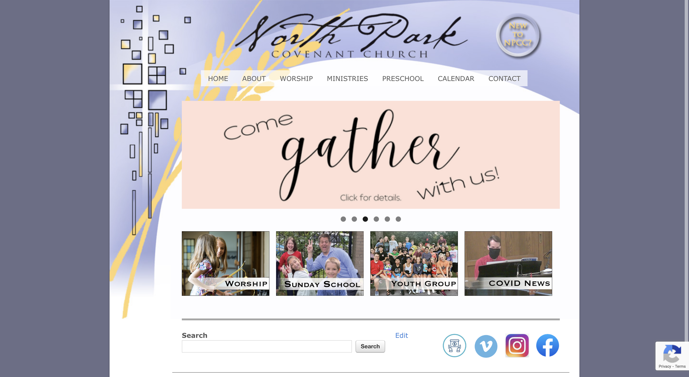

# North Park Covenant Church -- Custom WordPress Theme

## Overview

### Background

I have been on staff at North Park Covenant Church for several years as their Choir Director. In March of 2023, the church contracted [my wife](https://victoriagerman.com) and I to redesign and build a new WordPress site for them. This repo is the custom theme that I developed for that purpose. 

### Links

We are still in the testing/development phase of the project. Below are links to the church's current (old) site as well as a test version of the new site with our theme.

- [Old site](https://npcovenant.org)
- [New site (testing)](http://npcovenant.kodadesigns.net)

### Screenshots

## Our process

### Built with

- WordPress
- Figma
- HTML
- CSS
- SASS
- PHP

### What I have learned (so far)

On a technical level I learned a lot about semantic HTML and accessibility, writing maintainable SCSS, PHP, the WordPress ecosystem and how it differs from other content management systems, deployment and version control strategies for WordPress.

I also learned a lot about the design process, cultivating healthy client relationships, and estimating the amount of time necessary for development.

### Continued development

We hope to complete phase one of this project by the end of April 2023. Phase two would involve rethinking the members portal, Google calendar component, and the livestream subdomain.

## Author

- [Portfolio site](https://www.dominicgerman.com)
- [LinkedIn profile](https://www.linkedin.com/in/dominic-german/)
